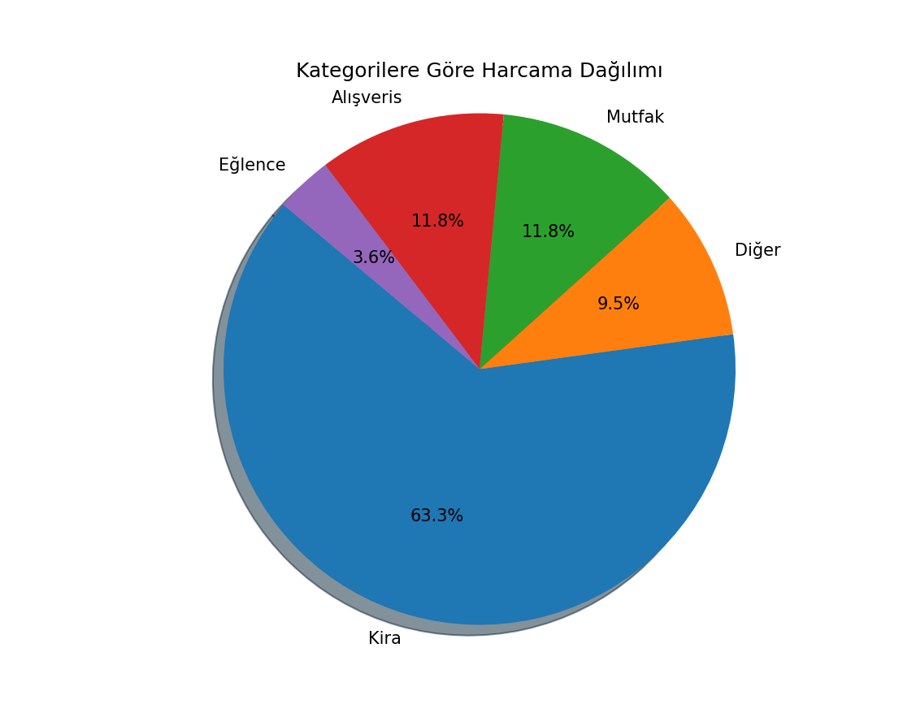
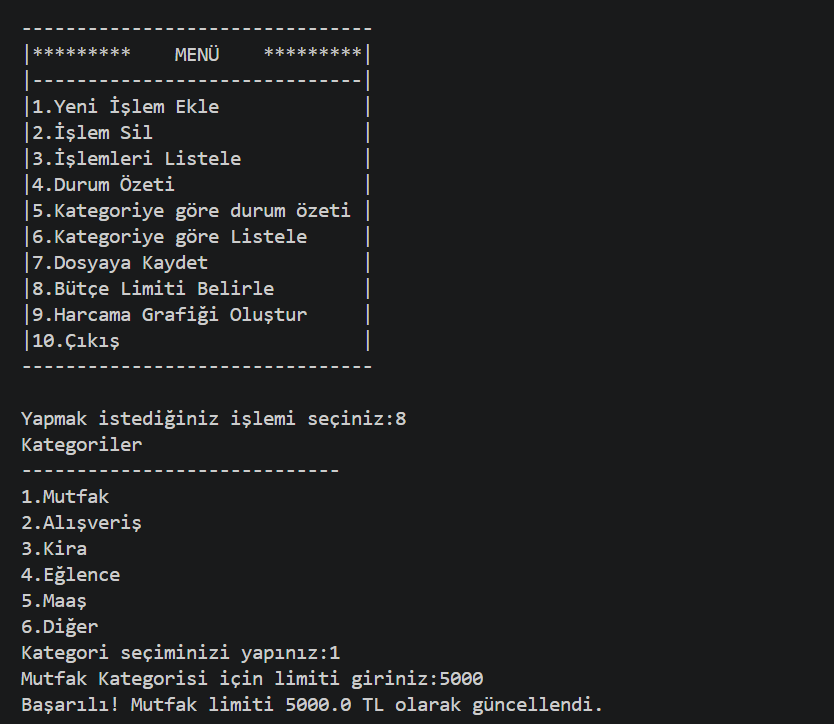

# 💰 Kişisel Bütçe Takip Uygulaması

Bu proje, Python programlama dilinin temel prensiplerini ve **Nesne Yönelimli Programlama (OOP)** mantığını kullanarak geliştirilmiş kapsamlı bir finansal yönetim aracıdır. Kullanıcıların gelir ve giderlerini kategorize ederek takip etmelerine, bütçe limitleri belirlemelerine ve verilerini görselleştirmelerine olanak tanır.

## 🚀 Öne Çıkan Özellikler

-   **Modüler Mimari:** Proje, temiz kod (clean code) prensiplerine uygun olarak mantıksal katmanlara ayrılmış modüler bir yapıya sahiptir.
-   **Kalıcı Veri Depolama (Persistence):** Tüm işlemler `butce_verileri.csv` dosyasına kaydedilir. Uygulama her açıldığında mevcut verileri otomatik olarak yükler.
-   **Gelişmiş Raporlama:** 
    -   **Durum Özeti:** Toplam gelir, toplam gider ve net bakiye takibi.
    -   **Kategori Filtreleme:** Harcamaların kategori bazlı detaylı dökümü ve hizalı tablo görünümü.
-   **Akıllı Karar Destek Sistemi:** Belirlenen kategori limitlerine yaklaşıldığında (%80) veya limit aşıldığında kullanıcıyı uyaran dinamik kontrol mekanizması.
-   **Veri Görselleştirme:** `matplotlib` kütüphanesi kullanılarak harcamaların dağılımını gösteren interaktif **Pasta Grafiği**.
-   **Hata Yönetimi ve Doğrulama:** Sayısal veri girişleri, boş alanlar ve dosya okuma hatalarına karşı `try-except` blokları ile güçlendirilmiş yapı.

## 🛠️ Kullanılan Teknolojiler

-   **Dil:** Python 3.x
-   **Veri Formatı:** CSV (Excel ile tam uyumlu)
-   **Kütüphaneler:**
    -   `csv`: Veri depolama ve okuma işlemleri.
    -   `os`: Dosya yolu ve varlık kontrolleri.
    -   `matplotlib`: Finansal veri görselleştirme.

## 📦 Kurulum ve Çalıştırma

1. Proje dosyalarını bilgisayarınıza indirin.
2. Gerekli kütüphaneleri terminal üzerinden yükleyin:
   ```bash
   pip install matplotlib

## 📸 Uygulamadan Görseller

### Finansal Analiz (Grafik)


### İşlem Takibi ve Limit Uyarıları
(images/uyari.png)